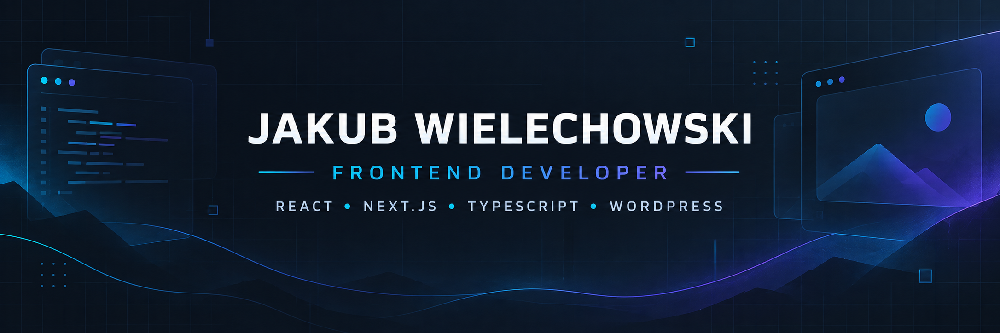

  

  
  
  

## 👋 About me

I'm a **Frontend Developer** building responsive, maintainable web applications with **React, Next.js, and TypeScript**.

- 💼 Commercial experience translating Figma designs into production interfaces
- 🔌 REST and GraphQL API integrations, including headless CMS projects
- 🧩 WordPress development with custom themes, Gutenberg, and WooCommerce
- 🏗️ Focused on reusable components, typed workflows, and clear frontend architecture
- 🌱 Expanding toward full-stack development with FastAPI and PostgreSQL

## ⚡ Tech stack

### Frontend

### CMS, APIs & backend

### Tools & workflow

## 🚀 Selected projects

<table>
  <tr>
    <td width="50%" valign="top">
      <h3>💰 Personal Finance Manager</h3>
      
Full-stack finance application with secure authentication, per-user data isolation, transaction tracking, and monthly summaries.

      
<strong>React · TypeScript · FastAPI · PostgreSQL · JWT</strong>

      
    </td>
    <td width="50%" valign="top">
      <h3>✅ TaskFlow Dashboard</h3>
      
Responsive SaaS-style task workspace with typed workflows, derived analytics, calendar planning, and mobile navigation.

      
<strong>Next.js · React · TypeScript · Tailwind CSS</strong>

      
    </td>
  </tr>
  <tr>
    <td width="50%" valign="top">
      <h3>🧩 Pixel WordPress Theme</h3>
      
Custom theme and Gutenberg plugin with WooCommerce, structured content models, responsive SCSS, and an interactive Three.js hero.

      
<strong>WordPress · PHP · Gutenberg · WooCommerce · Three.js</strong>

      
    </td>
    <td width="50%" valign="top">
      <h3>🖨️ Pixel na Warstwie</h3>
      
Responsive under-construction landing page for a 3D printing studio, designed as a focused and polished brand entry point.

      
<strong>Next.js · TypeScript · Tailwind CSS</strong>

      
    </td>
  </tr>
</table>

## 🎯 Currently developing

- 🧠 Deepening JavaScript and TypeScript fundamentals
- 🏗️ Improving scalable React architecture and application structure
- 🔄 Expanding frontend delivery toward full-stack and headless CMS workflows

## 📫 Let's connect

I'm open to frontend opportunities and conversations about React, Next.js, TypeScript, and WordPress projects.

  

   
  <strong>Thanks for visiting — feel free to explore my repositories.</strong>

